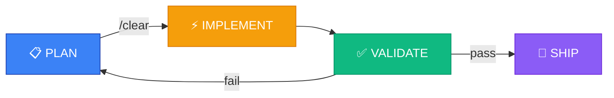
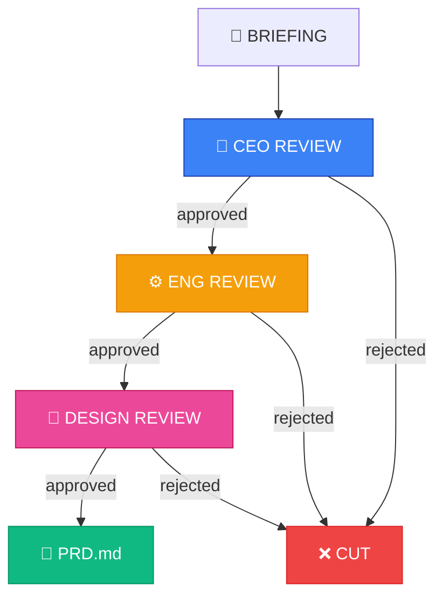
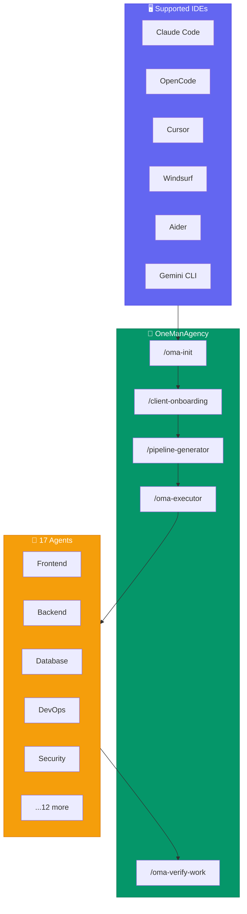

<div align="center">

# OneManAgency (v4.1)

**Open-source framework to build software like you have a full agency working for you.**

Multi-LLM Orchestration, native Context Engineering, PIV Loop, and TDD for Claude Code, OpenCode, Cursor, Windsurf, Aider, Hermes Agent, Roo Code, and Gemini CLI.

[](https://www.npmjs.com/package/onemanagency)
[](https://www.npmjs.com/package/onemanagency)
[](https://github.com/pauloarthurrocha/OneManAgency/stargazers)
[](https://github.com/pauloarthurrocha/OneManAgency/issues)
[](LICENSE)
[](https://nodejs.org)

*"Don't write prompts. Architect systems."*

</div>

---

## Why I Built This

I'm a solo builder. I build SaaS and products end-to-end.

I was tired of AI getting lost in large projects. Context window would fill up (the infamous **Lost in the Middle**), AI would forget the architecture, start writing that generic purple gradient design (the "AI Slop"), and generate untested code that broke in production.

Enterprise tools were too heavy for my workflow. So I took the best methodologies from Silicon Valley (Y Combinator, Spec-Driven Development, TDD) and created **OneManAgency (OMA)**.

The complexity lives in the system, not in your workflow. You keep using the IDE you love, but now your AI follows invisible corporate rules under the hood.

---

## How OMA Fixes AI

### PIV Loop (Plan-Implement-Validate)



OMA forbids AI from planning and coding in the same breath. Agent plans, generates Handoff, and warns: *"Clear the chat to avoid hallucination."* You clear, hit play, and AI codes with empty context and laser focus.

### 3-Gate Review Triad



Before coding, your briefing doesn't become code immediately. It's blocked by 3 "agents" (CEO, Tech Lead, Design Lead) that cut useless features, lock the database schema, and forbid "AI Slop."

### Architecture Overview



---

## Quick Start

```bash
# Install globally
npm install -g onemanagency@latest

# Create a new project
mkdir my-new-saas && cd my-new-saas

# Initialize OMA (auto-detects your IDE)
/oma-init
```

The installer auto-detects your IDE (`.claude`, `.opencode`, `.cursor`, `.roo`, `.gemini`, `.windsurf`, `.aider`, `.cline`) and injects skills there.

---

## 17 Specialized Personas

OMA uses strict `Agent Definition Files` in `src/agents/`. These are files that tell exactly what the agent hates and how it operates. **17 personas** triggered by `PIPELINE.md` via metadata `Agent: <name>`:

| Category | Agents |
|---|---|
| **Implementation (5)** | Frontend Specialist · Backend Specialist · Database Architect · DevOps Engineer · Mobile Specialist |
| **Design & Content (2)** | Design Specialist · Copywriter Specialist |
| **Quality (5)** | Code Reviewer · Accessibility Auditor · Performance Engineer · Reality Checker · Test Engineer |
| **Specialists (5)** | Security Auditor · SEO Specialist · MCP Builder · Chatbot Specialist · Lead Orchestrator |

---

## 9 Tested Playbooks

The `pipeline-generator` has ready playbooks for each project type:

| Playbook | Type | Stack |
|---|---|---|
| A | SaaS Full-Stack | Next.js + Supabase + Vercel |
| B | Static Landing Page | HTML/CSS + Vercel/Netlify |
| C | Landing Page Next.js | Next.js + Vercel |
| D | Python Automation | Python + FastAPI + Cloud Run |
| E | Low-Ticket / Infoproduct | HTML + Kiwify Checkout |
| F | Data Pipeline / ETL | Python + Airflow/Prefect + BigQuery |
| G | Mobile React Native | React Native + Expo + EAS |
| H | WhatsApp Chatbot | Node.js + Baileys/Botpress |
| I | Hybrid / Monorepo | Turborepo + shared packages |

---

## How It Works in Practice

### 1. Setup
```bash
mkdir meu-novo-saas && cd meu-novo-saas
/oma-init
```

### 2. Socratic Interview
OMA doesn't give you a passive form. The agent assumes the persona of a **Y Combinator Partner**. If you say "I want an app with 50 features", the AI asks: *"What's the real pain? Let's focus only on the feature that generates revenue on day 1."*

### 3. The Barrier (Triad)
The briefing passes through 3 automatic filters:
- **CEO Review** → Generates `PRD.md`
- **Eng Review** → Defines schema and data flow (`ARCHITECTURE.md`)
- **Design Review** → Defines tokens, typography, and anti-generic motion rules (`UI-SPEC.md`)

### 4. Execution (PIV Loop)
The Pipeline Generator slices everything into atomic tasks. You invoke `oma-executor`.
The AI plans the task, writes to disk, and asks you to clear the screen. You clear. On return, the Frontend agent (focused on accessibility and Tailwind) or Backend agent (focused on TDD) takes action. No hallucinations.

---

## Key Features

| Feature | Description |
|---|---|
| **Context Engineering** | Project state persisted on disk (`HANDOFF.md`, `STATE.md`), not in chat RAM |
| **PIV Loop** | Plan → /clear → Implement → Validate. Prevents hallucination. |
| **3-Gate Review** | CEO + Eng + Design cut useless features before code is written |
| **TDD Iron Law** | Backend agent is forbidden to write production code without a failing test first |
| **Batteries Included** | MCPs auto-configured: Puppeteer, Context7, Sequential Thinking, Memory |
| **Offline-First** | Works without internet after install. Native FileSystem, not shell scripts. |
| **Cross-IDE** | Claude Code, Cursor, OpenCode, Windsurf, Aider, Gemini CLI, and more |
| **Progressive Disclosure** | Skills load only essential (~200 lines), playbooks load on demand |

---

## Bring Your Own Agents

OMA triggers agents via metadata `Agent: <name>` in `PIPELINE.md`. Any `.md` file with frontmatter `name:` in `.agents/agents/` is eligible. You're not limited to the 17 core personas:

| Library | Stars | When it helps | How to integrate |
|---|---|---|---|
| [agency-agents](https://github.com/msitarzewski/agency-agents) | 73-94k | 144 agents in 12 divisions | Copy `.md` to `.agents/agents/` |
| [GStack](https://github.com/garrytan/gstack) (Garry Tan, YC) | — | 23 personas focused on product validation | Copy agent to `.agents/agents/` |
| [Superpowers](https://github.com/obra/superpowers) | — | 15 composite skills (TDD, debugging) | Use as **skill** in `.agents/skills/` |

---

## Inspiration (Prior Art)

I didn't invent the wheel. OMA is a synthesis of the brightest minds in Agentic Engineering and Design:

### Architecture & Product Management
- **[GStack](https://github.com/garrytan/gstack)** (Garry Tan) — Inspired our Review Triad
- **[Get-Shit-Done](https://github.com/gsd-build/get-shit-done)** — Inspired our lightweight file persistence
- **[Spec-Kit](https://github.com/github/spec-kit)** — Validated Spec-Driven Development

### Engineering
- **[Superpowers](https://github.com/obra/superpowers)** — Base of our Backend Specialist (TDD Iron Law)
- **[Agency-Agents](https://github.com/msitarzewski/agency-agents)** — Taught us that "shallow roleplay" doesn't work

### Anti-"AI Slop"
- **[Impeccable](https://github.com/pbakaus/impeccable)** & **[Taste-Skill](https://github.com/leonxlnx/taste-skill)** — Defense against AI Slop
- **[Emil Kowalski's Philosophy](https://emilkowal.ski/)** — Backbone of our Design Specialist
- **[Huashu Design](https://github.com/alchaincyf/huashu-design)** — Rapid prototyping insights

If you like OMA, please consider giving a Star to the repos of these giants. We stand on their shoulders.

---

## Continuous Integration (24/7 Coworking)

Since OMA uses files on disk (Context Engineering) instead of chat memory, it's the perfect engine for autonomous terminal orchestrators:

- **[AionUi](https://github.com/iOfficeAI/AionUi)** — Instantiate multiple terminals side by side. AionUi is the "office", OMA is the "method".
- **[Hermes Agent](https://github.com/NousResearch/hermes-agent) / OpenClaw** — Run the agency on a VPS and command agents via Telegram or Discord.

---

<div align="center">

*"You don't level up your code by asking nicely. You level up by building systems that forbid bad code."*

**MIT License | Made by a builder, for builders.**

</div>
